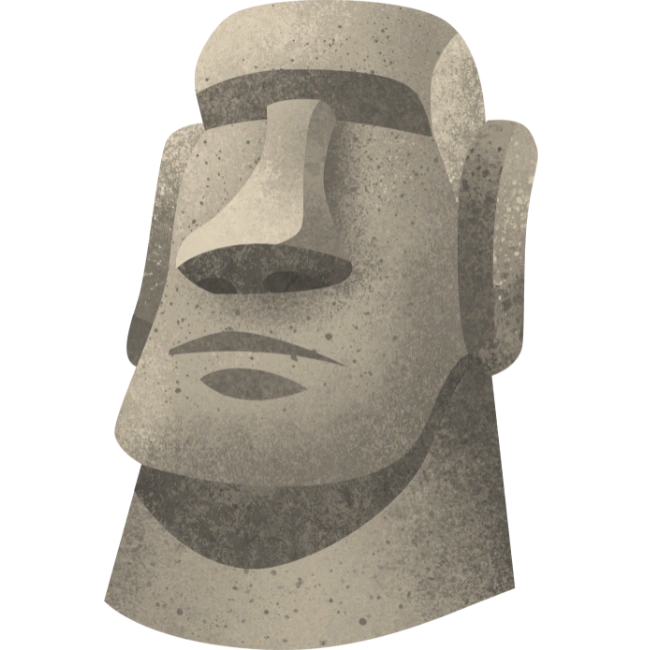

  

<h1 align="center">🤖 MoAI — Koło Naukowe Sztucznej Inteligencji</h1>

  <a href="https://moai-pl.github.io"><strong>🌐 moai-pl.github.io</strong></a>

  <a href="https://www.linkedin.com/company/moai-pl">LinkedIn</a> ·
  <a href="https://www.instagram.com/moai_pl">Instagram</a>

---

## 🇵🇱 Polski

**MoAI** to interdyscyplinarne Koło Naukowe Sztucznej Inteligencji działające na Politechnice Lubelskiej. Łączymy studentów z różnych wydziałów, żeby razem prowadzić badania nad AI i ML, popularyzować wiedzę o sztucznej inteligencji oraz reprezentować naszą uczelnię na konferencjach, hackathonach i wydarzeniach w Polsce i całej Unii Europejskiej.

- 🔬 **Badania** — projekty badawcze i wdrożeniowe z zakresu AI, ML, GovTech, MedTech i innych dziedzin
- 📢 **Popularyzacja wiedzy** — warsztaty, prelekcje i wystąpienia na konferencjach naukowych i branżowych
- 🏆 **Hackathony i konkursy** — regularne starty i zwycięstwa na arenie krajowej i międzynarodowej
- 🤝 **Współpraca** — partnerstwa z firmami, instytucjami i innymi kołami naukowymi w Polsce i UE

👉 Zobacz nasze projekty, wydarzenia i zespół na **[moai-pl.github.io](https://moai-pl.github.io)**

---

## 🇬🇧 English

**MoAI** is an interdisciplinary Artificial Intelligence Student Research Club at Lublin University of Technology. We bring together students from different faculties to conduct AI and ML research, popularize knowledge about artificial intelligence, and represent our university at conferences, hackathons, and events across Poland and the European Union.

- 🔬 **Research** — research and applied projects in AI, ML, GovTech, MedTech, and beyond
- 📢 **Science communication** — workshops, talks, and presentations at scientific and industry conferences
- 🏆 **Hackathons & competitions** — regular participation and wins on the national and international stage
- 🤝 **Partnerships** — collaboration with companies, institutions, and other student clubs across Poland and the EU

👉 Check out our projects, events, and team at **[moai-pl.github.io](https://moai-pl.github.io)**
